<h3><code>mhmdsamer@github ~ $ ./contributions.sh</code></h3>

  

<h3><code>mhmdsamer@github ~ $ whoami</code></h3>

<table>
  <tr>
    <td valign="top"></td>
    <td valign="top"></td>
  </tr>
</table>

 

<h3><code>mhmdsamer@github ~ $ ls ~/projects</code></h3>

  

<a href="https://github.com/mhmdsamerdev/VertiFlow"><code>vertiflow</code></a> ·
<a href="https://github.com/mhmdsamerdev/NetLanding"><code>netlanding</code></a> ·
<a href="https://github.com/mhmdsamerdev/Shelfie"><code>shelfie</code></a> ·
<a href="https://github.com/mhmdsamerdev/CleanRename"><code>cleanrename</code></a>

  

<a href="mailto:mhmdsamer.dev@gmail.com">email</a> ·
<a href="https://linkedin.com/in/mhmdsamer-dev">linkedin</a>

